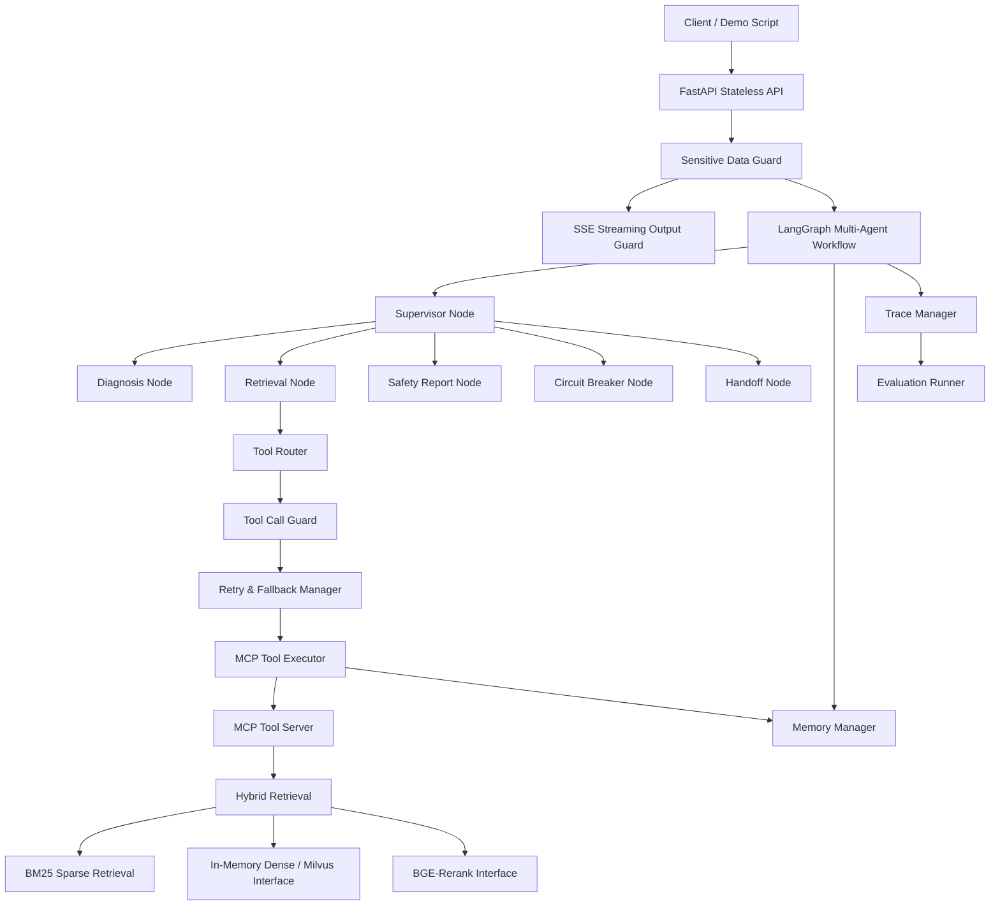
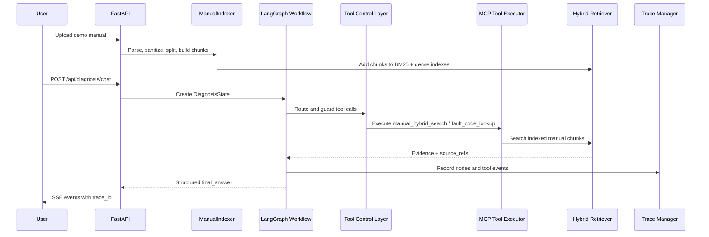

# ManualMind-Agent

A production-style multi-agent fault diagnosis system for complex equipment manuals.

ManualMind-Agent is a Python/FastAPI engineering project for diagnosing industrial equipment faults from manuals, fault code tables, maintenance instructions, safety rules, and historical cases. It is designed as more than a simple RAG demo: the project emphasizes controlled tool calling, hybrid retrieval, streaming safety filtering, traceability, retry/fallback handling, circuit breakers, and human handoff.

## Highlights

- LangGraph supervisor-worker multi-agent workflow.
- MCP-style tool execution layer with registry, executor, schemas, and structured errors.
- BM25 + dense vector + rerank hybrid retrieval pipeline.
- Sensitive data guard for input, tool arguments, document ingestion, and SSE output.
- Tool Router / Tool Call Guard / Retry / Fallback / Circuit Breaker control layer.
- Human handoff payload generation for unsafe or unresolved cases.
- Trace & Evaluation layer for workflow events, tool calls, retrieval quality, fallback, and handoff decisions.
- FastAPI API layer with SSE streaming diagnosis responses.
- Runnable end-to-end demo using an A100 air compressor manual and E03 fault code.

## Architecture



## End-To-End Flow



## Quick Start

```powershell
python -m venv .venv
.\.venv\Scripts\activate
pip install -r requirements.txt
```

Run the local demo without starting the API server:

```powershell
.\.venv\Scripts\python.exe scripts\demo_run.py
```

Start FastAPI:

```powershell
uvicorn app.main:app --reload
```

Run tests:

```powershell
.\.venv\Scripts\python.exe -m pytest
```

Expected test result:

```text
71 passed, 1 warning
```

The warning is from the FastAPI/TestClient `httpx` deprecation path and does not affect the current demo.

## Demo Output

`scripts/demo_run.py` indexes `data/demo_manuals/a100_manual.md`, runs an E03 diagnosis, and prints the trace id, source references, and final report.

```text
indexed_doc_id: demo-a100-manual
chunks_count: 5
trace_id: trace-<generated>
source_refs: ['a100_manual.md', 'a100_manual.md:1']
final_answer:
故障识别：
E03 表示温度传感器异常。控制器检测到温度传感器信号超出正常范围，可能导致温度读数不稳定、保护停机或过热报警

可能原因：
- 温度传感器接线松动或端子氧化
- 温度传感器探头损坏
- 冷却风扇堵塞导致局部温度异常
- 控制器采样通道异常

排查步骤：
1. 先断电并等待设备冷却
2. 检查温度传感器插头、线束和端子
3. 清理冷却风道和风扇滤网
4. 复位后观察 E03 是否再次出现
5. 如 E03 持续出现，更换温度传感器并记录维修结果

安全提醒：
- 处理 E03 前必须断电、等待冷却，禁止带压拆卸温度传感器

引用来源：
- a100_manual.md
- a100_manual.md:1
```

See [docs/demo.md](docs/demo.md) for a longer walkthrough.

## API Examples

Upload the demo manual:

```powershell
curl.exe -X POST http://127.0.0.1:8000/api/manual/upload `
  -F "file=@data/demo_manuals/a100_manual.md;type=text/markdown"
```

Index the returned `doc_id`:

```powershell
curl.exe -X POST http://127.0.0.1:8000/api/manual/index `
  -H "Content-Type: application/json" `
  -d "{\"doc_id\":\"<doc_id>\",\"device_name\":\"空压机 A100\",\"device_model\":\"A100\"}"
```

Run diagnosis chat with SSE:

```powershell
curl.exe -N -X POST http://127.0.0.1:8000/api/diagnosis/chat `
  -H "Content-Type: application/json" `
  -d "{\"session_id\":\"demo-session\",\"message\":\"空压机 A100 报 E03，应该如何排查？\"}"
```

Query trace events:

```powershell
curl.exe http://127.0.0.1:8000/api/trace/<trace_id>/events
```

## Project Structure

```text
app/
  agents/        LangGraph workflow, tool-service integration, report formatter
  api/           FastAPI routers for manual, diagnosis, trace, eval, health
  core/          Config, dependencies, SSE helpers
  evaluation/    Evaluation schemas and runner
  ingestion/     Manual parsing, splitting, metadata, in-memory indexing
  mcp_server/    MCP-style tool schemas, registry, executor, tool implementations
  memory/        Memory interfaces and in-memory implementation
  retrieval/     BM25, dense retriever interface, hybrid search, reranker
  schemas/       Pydantic schemas for diagnosis, tools, retrieval, traces, documents
  security/      Sensitive data detector, sanitizer, streaming output guard
  tools/         Tool router, guard, retry/fallback, validator, circuit breaker
  tracing/       In-memory trace manager
data/
  demo_manuals/  A100 demo equipment manual
docs/
  architecture.md
  demo.md
  interview_notes.md
scripts/
  demo_run.py
tests/
```

## Current Scope

This repository currently uses in-memory components so the full demo can run locally without external services. Real LLM calls, real Milvus deployment, production BGE rerank model loading, PDF/OCR parsing, and durable memory are intentionally left for later iterations.

## Roadmap

- Add real Milvus persistence and collection management.
- Add production BGE embedding and rerank implementations.
- Add PDF parsing and OCR adapters for scanned manuals.
- Add a real MCP transport layer around the local tool server.
- Add durable memory backends for session, task, tool, safety, and case memory.
- Expand evaluation datasets and regression metrics.
- Add authentication and tenant-aware access control for production API usage.
