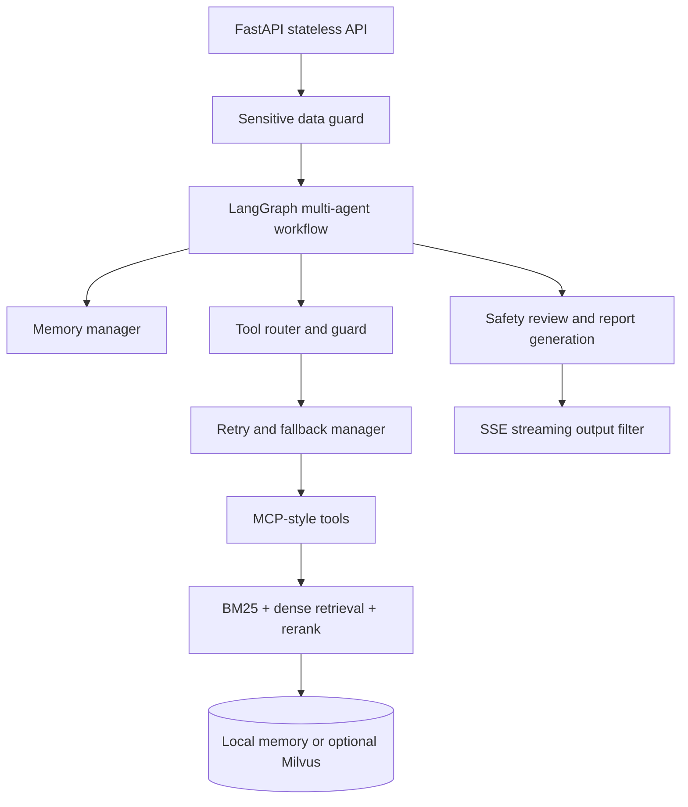

# ManualMind-Agent

English | [中文](README.zh-CN.md)

## Overview

ManualMind-Agent is a production-style multi-agent fault diagnosis system for complex equipment manuals. It combines document ingestion, hybrid retrieval, controlled tool execution, LLM-assisted report generation, streaming responses, safety checks, and human handoff.

The project uses synthetic manuals and evaluation data only. It is designed as an engineering portfolio project that shows how an agent system can be structured beyond a simple RAG demo.

## Features

- Multi-agent diagnosis workflow with supervisor, diagnosis, retrieval, safety/report, circuit breaker, and handoff stages.
- Controlled tool calling through a router, guard, retry/fallback manager, and MCP-style tool registry.
- Hybrid retrieval with local BM25, dense retrieval abstraction, metadata filters, result merging, and rerank interface.
- Optional Milvus vectorstore backend with local memory fallback when Milvus is not configured or unavailable.
- Optional LLM report generation with Qwen/DashScope as the recommended provider and DeepSeek as an alternative provider.
- SSE streaming response with sensitive data filtering.
- Document upload, parsing, chunking, indexing, scoped retrieval, and source references.
- Testable memory, safety, trace, evaluation, and fallback behavior.

## Architecture



FastAPI remains stateless. Session state, task state, tool call records, and safety audit records are handled by the memory layer.

## Tech Stack

- Python, FastAPI, Pydantic
- LangGraph-style workflow orchestration
- Local BM25 retrieval, dense retrieval interface, optional Milvus backend
- OpenAI-compatible LLM clients for Qwen/DashScope and DeepSeek
- SSE streaming, sensitive data masking, retry/fallback control
- Pytest test suite

## Quick Start

```powershell
python -m venv .venv
.\.venv\Scripts\activate
pip install -r requirements.txt
```

Run the API:

```powershell
uvicorn app.main:app --reload
```

Run tests:

```powershell
.\.venv\Scripts\python.exe -m pytest
```

## Environment Variables

Core LLM settings:

```text
LLM_ENABLED=true
LLM_PROVIDER=qwen
LLM_MODEL=qwen-plus
LLM_TIMEOUT_SECONDS=20
LLM_MAX_RETRIES=2
```

Qwen / DashScope, recommended:

```text
DASHSCOPE_API_KEY=<your_dashscope_api_key>
DASHSCOPE_BASE_URL=https://dashscope.aliyuncs.com/compatible-mode/v1
```

DeepSeek, optional:

```text
DEEPSEEK_API_KEY=<your_deepseek_api_key>
DEEPSEEK_BASE_URL=https://api.deepseek.com
```

Optional Milvus vector backend:

```text
VECTORSTORE_BACKEND=local
MILVUS_URI=<your_milvus_uri>
MILVUS_TOKEN=<your_milvus_token>
MILVUS_COLLECTION=manualmind_chunks
MILVUS_DIM=64
EMBEDDING_PROVIDER=mock
EMBEDDING_MODEL=mock
```

When `VECTORSTORE_BACKEND` is unset or set to `local`, the project uses local in-memory retrieval. If Milvus is enabled but unavailable, the service falls back to memory.

## Testing

Current validation result:

```text
169 passed, 1 warning
```

The warning is a FastAPI/Starlette TestClient deprecation warning and does not affect project behavior.

## Deployment

Render deployment can use the standard Python web service flow:

- Build command: `pip install -r requirements.txt`
- Start command: `uvicorn app.main:app --host 0.0.0.0 --port $PORT`
- Configure provider keys and optional Milvus settings in Render environment variables.

Do not commit API keys, tokens, or service credentials.

## Roadmap

- Add production-grade persistent memory and audit storage.
- Add real embedding and rerank providers behind the existing interfaces.
- Expand OCR support for scanned manuals.
- Add stronger observability for tool calls, retrieval quality, and handoff decisions.

## Security Notes

- Never commit API keys, Milvus tokens, internal URLs, device identifiers, or customer data.
- Use environment variables or a secret manager for provider credentials.
- Rotate credentials immediately if a key or token is exposed.
- Keep uploaded manuals and evaluation data sanitized before sharing demos.

## Author

ManualMind-Agent is maintained as an agent engineering portfolio project.
