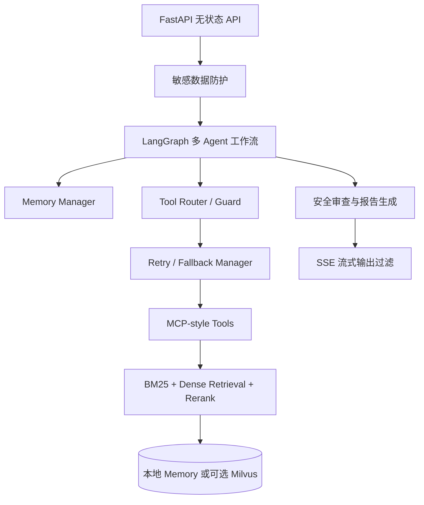

# ManualMind-Agent

[English](README.md) | 中文

## 项目简介

ManualMind-Agent 是一个面向复杂设备手册的多 Agent 故障诊断系统。项目覆盖文档上传、解析、切分、混合检索、受控工具调用、LLM 辅助报告、安全审查、流式响应和人工接管等关键链路。

本仓库仅使用合成手册和合成评测数据，不包含真实厂商资料、企业内部文档或生产客户数据。项目定位是展示一个比普通 RAG Demo 更完整的 Agent 工程架构。

## 核心功能

- 多 Agent 诊断流程，包含 Supervisor、Diagnosis、Retrieval、Safety/Report、Circuit Breaker 和 Handoff。
- 工具调用统一经过 Router、Guard、Retry/Fallback Manager 和 MCP-style 工具注册层。
- 混合检索支持本地 BM25、dense retrieval 抽象、metadata filter、候选合并和 rerank 接口。
- Milvus 作为可选 vectorstore backend；未配置或连接失败时自动回退到本地 memory。
- LLM 报告生成支持 OpenAI-compatible provider，推荐 Qwen/DashScope，也可选 DeepSeek。
- SSE 流式输出结合敏感信息过滤，避免敏感内容泄露。
- 支持文档上传、索引、doc_ids 范围检索和 source references。
- 记忆、审计、fallback、熔断和评测逻辑均可测试。

## 系统架构



FastAPI 层保持无状态，session、task、tool call 和 safety audit 等状态由 Memory Manager 管理。

## 技术栈

- Python, FastAPI, Pydantic
- LangGraph-style 多 Agent 编排
- 本地 BM25、dense retrieval 接口、可选 Milvus backend
- Qwen/DashScope 与 DeepSeek 的 OpenAI-compatible LLM client
- SSE 流式响应、敏感信息脱敏、retry/fallback 控制
- Pytest 自动化测试

## 快速开始

```powershell
python -m venv .venv
.\.venv\Scripts\activate
pip install -r requirements.txt
```

启动 API：

```powershell
uvicorn app.main:app --reload
```

运行测试：

```powershell
.\.venv\Scripts\python.exe -m pytest
```

## 环境变量

LLM 核心配置：

```text
LLM_ENABLED=true
LLM_PROVIDER=qwen
LLM_MODEL=qwen-plus
LLM_TIMEOUT_SECONDS=20
LLM_MAX_RETRIES=2
```

Qwen / DashScope，推荐：

```text
DASHSCOPE_API_KEY=<your_dashscope_api_key>
DASHSCOPE_BASE_URL=https://dashscope.aliyuncs.com/compatible-mode/v1
```

DeepSeek，可选：

```text
DEEPSEEK_API_KEY=<your_deepseek_api_key>
DEEPSEEK_BASE_URL=https://api.deepseek.com
```

可选 Milvus 向量后端：

```text
VECTORSTORE_BACKEND=local
MILVUS_URI=<your_milvus_uri>
MILVUS_TOKEN=<your_milvus_token>
MILVUS_COLLECTION=manualmind_chunks
MILVUS_DIM=64
EMBEDDING_PROVIDER=mock
EMBEDDING_MODEL=mock
```

不配置 `VECTORSTORE_BACKEND` 或设置为 `local` 时，系统使用本地 in-memory 检索。启用 Milvus 但服务不可用时，会自动回退到 memory。

## 测试

当前测试结果：

```text
169 passed, 1 warning
```

该 warning 来自 FastAPI/Starlette TestClient 的 deprecation 提示，不影响项目功能。

## 部署

Render 可按普通 Python Web Service 部署：

- Build command: `pip install -r requirements.txt`
- Start command: `uvicorn app.main:app --host 0.0.0.0 --port $PORT`
- 在 Render 环境变量中配置 LLM provider key，以及可选的 Milvus 参数。

不要把 API Key、token 或服务凭据提交到仓库。

## 后续规划

- 增加生产级持久化 memory 与审计存储。
- 接入真实 embedding 与 rerank provider，并复用现有接口。
- 增强扫描版 PDF/OCR 手册解析能力。
- 完善工具调用、检索质量和人工接管链路的可观测性。

## 安全说明

- 不要提交 API Key、Milvus token、内部 URL、设备标识或客户数据。
- 生产部署应使用环境变量或密钥管理服务保存凭据。
- 如果密钥泄露，应立即吊销并轮换。
- 对外演示前应确认上传手册和评测数据已经脱敏。

## 作者

ManualMind-Agent 是一个用于展示 Agent 工程能力的个人项目。
